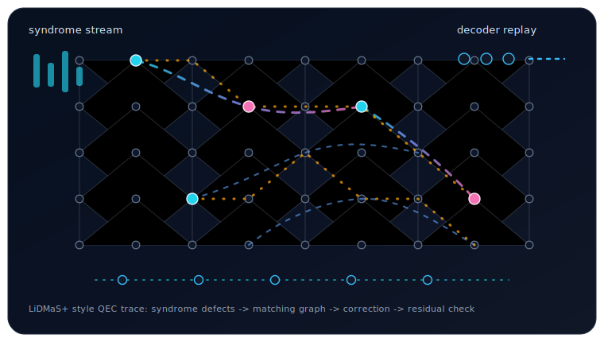

  Quantum Error Correction • Photonic/CV Simulation • Quantum Architecture • Open-Source Research Software

  
  
  
  
  
  
  
  
  

I am a quantum error correction and quantum software researcher building infrastructure for fault-tolerant, photonic, and hybrid quantum architectures. My work focuses on decoder benchmarking, architecture-level simulation, reproducible scientific computing, and hardware-to-decoder workflows.

I am currently developing **LiDMaS+**, a C++/Rust logical-decoder benchmarking engine for replay-driven QEC studies, decoder comparability, syndrome diagnostics, and reproducible threshold-style workflows. I also build **SchroSIM**, a hardware-agnostic photonic quantum simulator for continuous-variable circuits, Gaussian/non-Gaussian simulation paths, and GKP-oriented architecture studies.

**Focus:** quantum error correction, decoder benchmarking, photonic/CV simulation, GKP codes, tensor-network methods, scientific computing, and compiler-aware quantum architecture modeling

 

<table>
<tr>
<td width="70%" valign="top">
  
- **Mentor:** IBM Quantum — QAMP & QGSS
- **Active in:** PennyLane, Qiskit, Mitiq, Qibolab, and Unitary Foundation initiatives
- **Reach me:** dwayo3@gatech.edu

</td>
<td width="30%" align="center">

</td>
</tr>
</table>
